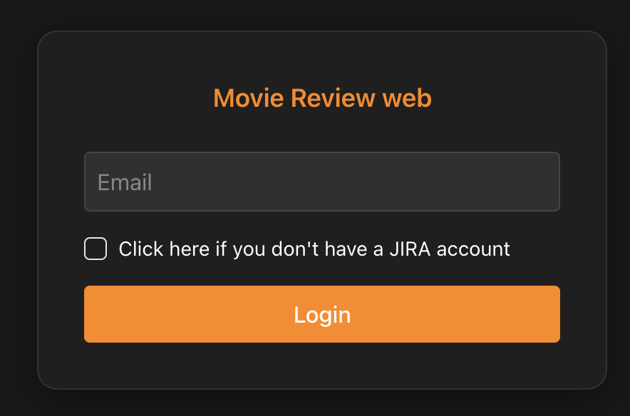
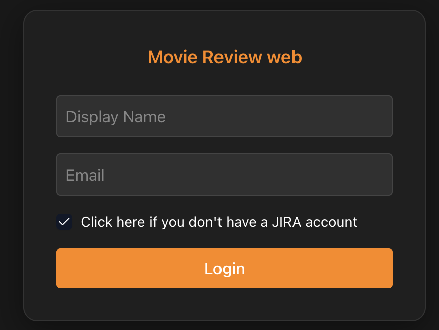
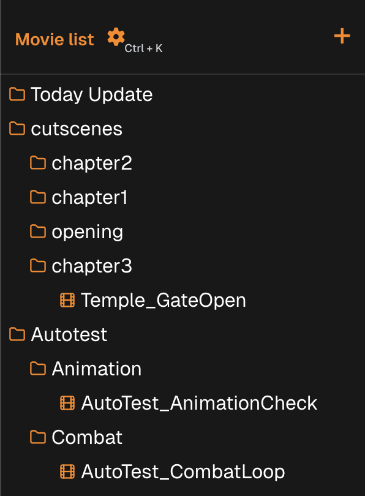
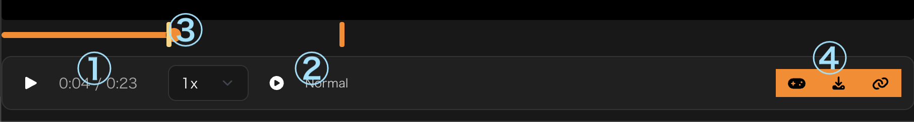
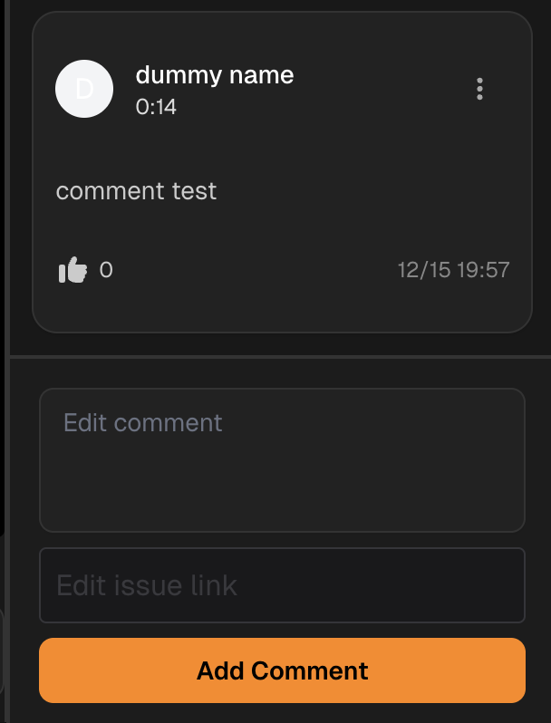
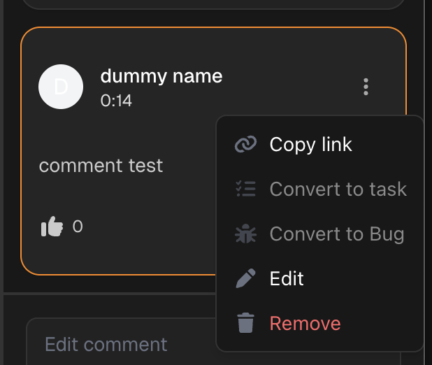
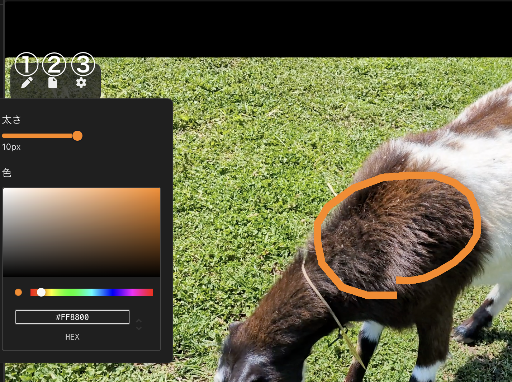
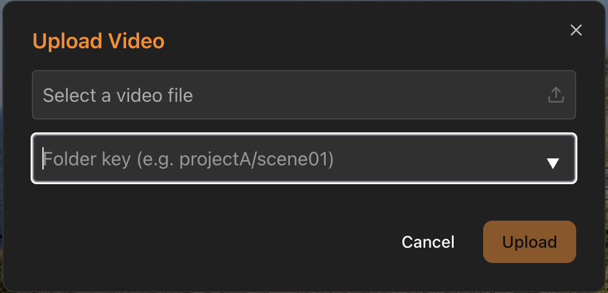
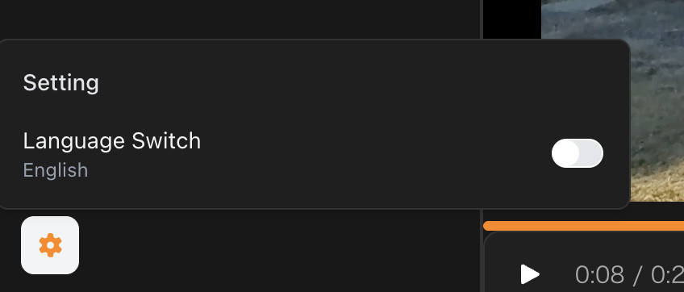

# VideoReview – User Guide (English Version)

## Login
To use the Video Review system, you must first login.  
You can login with your JIRA account or as a guest using name and email address.

### 1. Login with a JIRA Account

If you have a JIRA account, enter your email address to access all features of VideoReview.
* Adding comments and creating JIRA tickets
* Integrations with external services (e.g., linking JIRA issues)

### 2. Login as a Guest

If you don't have a JIRA account,  
check the box "Click here if you don't have a JIRA account" and login with just your email and name.

Guest login allows basic viewing and commenting, but external service integrations  
(e.g., posting to Slack or creating JIRA issues) are disabled.

---

## Video List

Select the video you want to review from the list.  
Videos are organized into folders. Clicking a folder will expand it and show the videos inside.

You can use the **⚙️ settings icon** at the top of the list to search videos.

---

## Playback Control Bar

### ① Playback Controls  
Play/Pause the video, adjust playback speed, and configure playback behavior.

### ② Playback Mode  
- **Normal:** Plays once from start to end  
- **Loop:** Returns to the start when finished  
- **Auto Next:** Automatically plays the next video when finished  

### ③ Timeline Seek Bar  
- Shows playback position  
- Drag to move to any timestamp  
- Comment timestamps appear as markers  

### ④ Other Action Icons  
- **Link:** Copy a link referencing the current timestamp  
- **Download:** Download the video file  
- **Controller:** Opens a URL if the video has a `scenePath`

---

## Comment Panel

View and post comments for the selected video.  
Search comments using the **⚙️ icon** at the top.

To add a comment:
1. Type in the text box  
2. Click **Add**

---

## Comment Menu Actions

- **Copy Link**  
- **Create Task (Jira)**  
- **Create Bug (Jira)**  
- **Edit / Drawing Mode**  
- **Delete**

---

## Drawing Tool

From the edit menu, you can draw directly onto the video.

Tools:
- Pen / Eraser  
- Clear Canvas  
- Pen Size & Color  

Click **Update Comment** to save.

---

## Uploading Videos

Upload videos using the **“＋”** button.

Notes:
- Supported format: **mp4**
- **Folder Key** decides where the video appears in the tree

---

## Language Switching

Change the interface language using the **⚙️ icon** at the bottom of the Video List.

